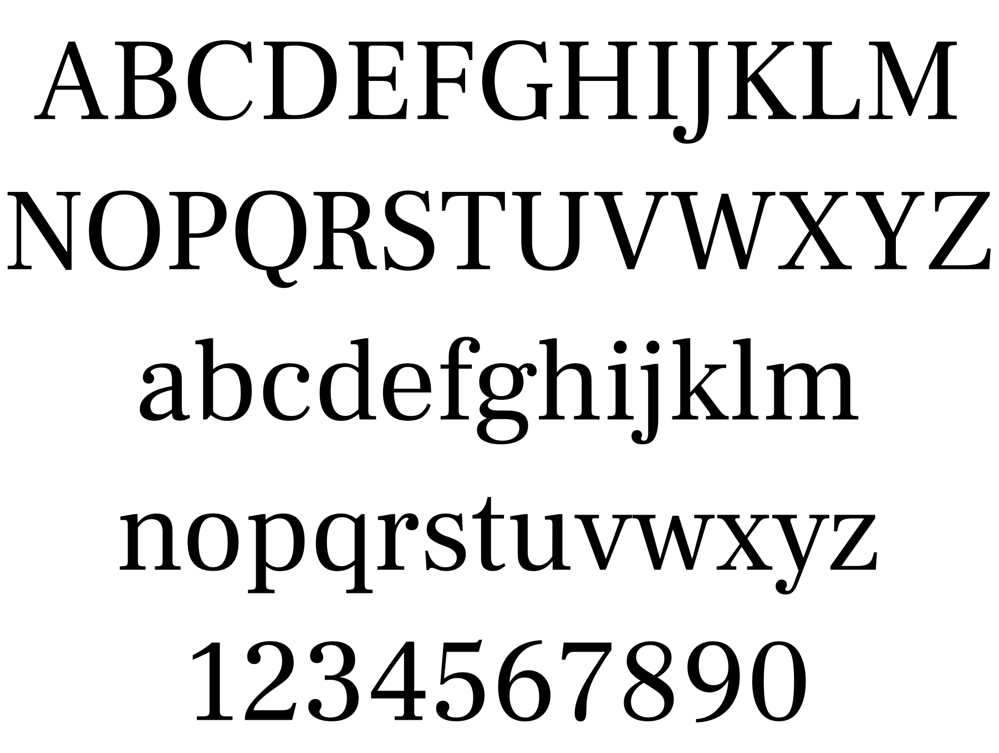

# Frank Ruhl Libre

An open source version of the classic Hebrew typeface _Frank Rühl_

## About Frank-Rühl

The most ubiquitous Hebrew typeface in print, Frank Rühl was designed in 1908 by Rafael Frank in collaboration with Auto Rühl of the C. F. Rühl foundry of Leipzig. 
A final version was released in 1910. 
Many Israeli books, newspapers and magazines use Frank Rühl as their main body text typeface.

Made to accommodate the growing need for typefaces in secular Hebrew writings, the typeface was fitted to modern printing demands and designed to be readable in longform text, with and without vowel marks.

Frank Rühl has Sephardi proportions (mem-height is approximately 4½ stroke widths), and is based roughly on Venetian typefaces used by printer Daniel Bomberg. 
Frank wrote of his design that he wishes to combine the simpleness of Antiqua with the "pleasantness" of Fraktur, leading him to "quieten" the letterforms by reducing the contrast between its thin and thick strokes.

This newly designed revival of the typeface features a family of 5 weights (the original typeface had only one.)

## About Yanek Iontef

USSR-born, Israeli based Yanek Iontef studied graphic design at Bezalel Academy of Art and Design, Jerusalem. 
He worked as a graphic designer in London and Tel Aviv. 
Since 1995 he has taught typography and type design at the Bezalel Academy in Jerusalem and Shenkar College of Engineering and Design in Ramat Gan. 
He currently works in Tel Aviv as a freelance designer specializing in type design, corporate identity and editorial design. 
An award-winning type designer, he also has his own type foundry (FONTEF), producing a range of Hebrew and Latin fonts.

## Links

* [Fontef](http://fontef.com)
* [Wikipedia (Hebrew)](https://he.wikipedia.org/wiki/%D7%A4%D7%A8%D7%A0%D7%A7-%D7%A8%D7%99%D7%94%D7%9C)
* [Original article by Rafael Frank on the design of Frank-Rühl (German, PDF)](http://www.tau.ac.il/~stoledo/fonts/frank-scanned.pdf)
* [Translated article by Rafael Frank (Hebrew, PDF)](http://www.tau.ac.il/~stoledo/fonts/frank-hebrew.pdf)
